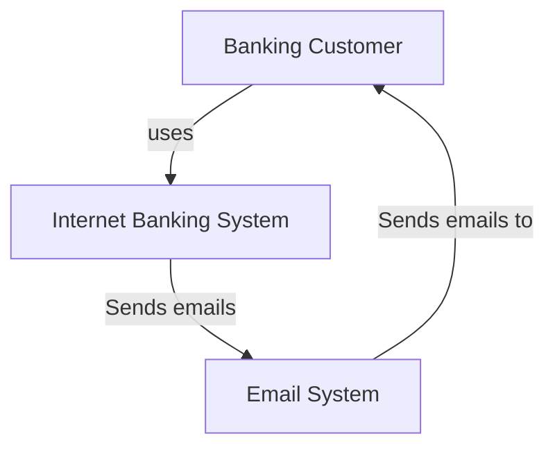
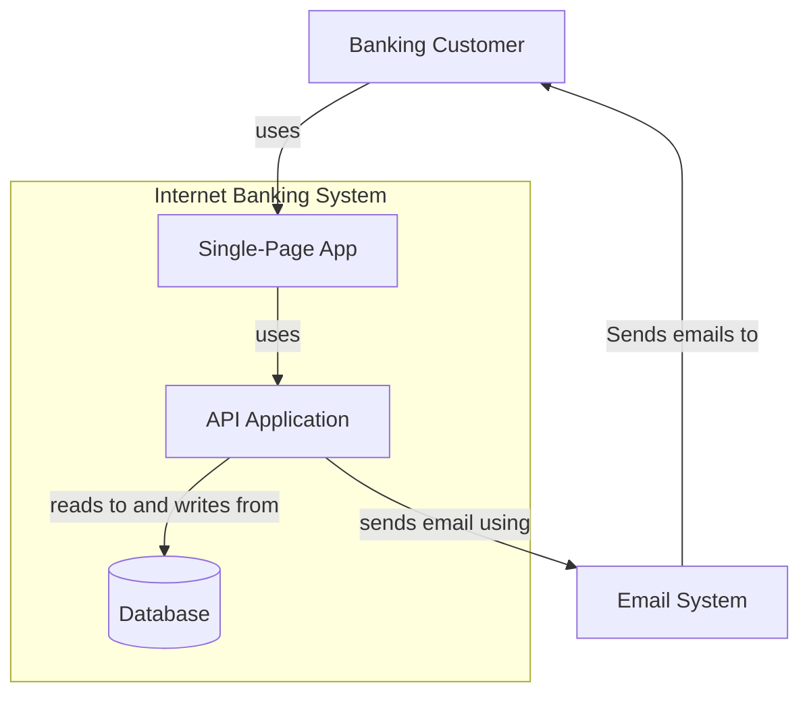

# Overview
The software-delivery standard is like a party planner for your projects! It provides a simple and straightforward way for you to [design](#architecture), develop, and track projects. Plus, it ensures you have the most up-to-date information, so you never have to worry about missing out on the latest and greatest. With the architecture standard, you can stay on top of your projects and never miss a beat!

## Architecture

### Design Doc

###### _A one-pager dedicated to answering most questions about the service that can be answered without diving into the code itself._ 

#### Summary

###### _a breif intended to provide an overview of the project for both business and technical audiences._  

##### Business Opportunity

###### _What is prompting this._

##### Solution summary

###### _a brief overview of the response to the business opportunity. Should call out primary dependencies._  

##### C4 System View (systems to systems)  

###### _"A software system is the highest level of abstraction and describes something that delivers value to its users, whether they are human or not. This includes the software system you are modelling, and the other software systems upon which your software system depends (or vice versa). In many cases, a software system is "owned by" a single software development team."_ [c4model.com](https://c4model.com/#SystemContextDiagram)

##### C4 Container View (components to components, within the system)  

###### _" container is essentially a context or boundary inside which some code is executed or some data is stored. And each container is a separately deployable/runnable thing or runtime environment, typically (but not always) running in its own process space. Because of this, communication between containers typically takes the form of an inter-process communication."_ [c4model.com](https://c4model.com/#ContainerDiagram)

##### Disaster Recovery Strategy
  - [ ] Active-Passive  

###### Implement redundant active servers with a single passive server in order to protect against outages. When an active server fails, the passive server can be promoted to active status and take over the load.  
  - [ ] Active-Active  

###### Utilize two or more active servers with each one in a different data center and configured to handle the same workload. This ensures that if one data center fails, the other can pick up the slack without any downtime.  

##### High Availability Strategy  
  - Availability Requirements  
    - Define service level agreement (SLA) requirements for uptime and response times based on customer needs.  
  - Scalability & Performance  
    - Implement proper load balancing algorithms to ensure scalability and performance when dealing with large amounts of traffic. Additionally, use caching mechanisms to reduce latency and optimize performance.
##### [12 Factor Checklist](./12_factor_checklist.md)
